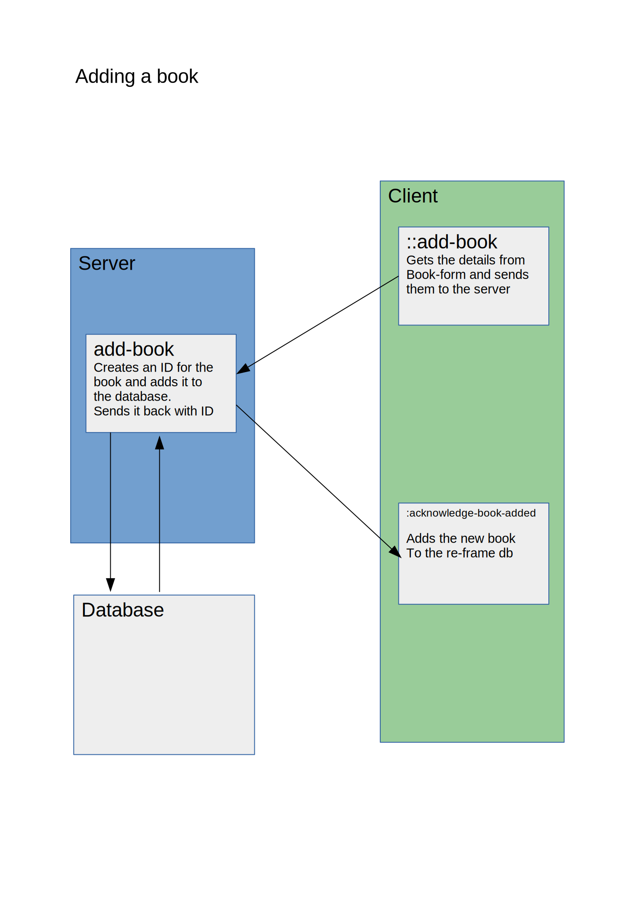

# books

A [re-frame](https://github.com/day8/re-frame) application designed to catalogue and keyword a collection of books.
(but mostly to demo using pneumatic tubes to send re-frame events to and from clojure)

## Getting Started
C-c C-x j j  (M-x cider-jack-in-clj) select lein as the app
(start-dev)

C-c C-x s s  (M-x cider-connect-sibling-cljs)
This will open a cljs repl and run the code that starts the tube.
Open one or more browser windows at localhost:8280

Adding a book will send the name of the book to the server where it can be seen in the clj repl.
A re-frame event :acknowledge-book-added will also be sent from the server to the client which can be seen in the js console.

## Details

Book details are entered in the re-frame/clojurescript front end. They are then passed to the clojure backend where they are 
stored in the database and passed back to the frontend for display. Any number of front end instances can be connected and
will receive updates as they are entered.

## TODO

Book model uses only strings. These should at least be checked in the case of links and dates.

Add a local link for each book, and a mechanism to open it on click. Probably send an event to the server which can easily
open a file using open or xd-open. Browser file:// link would probably be ok as a first step.

Authentication. It needs some if it is to be anything other than a private tool.

Re-factor the book model. Storing each field as an individual atom is probably not the best way.
